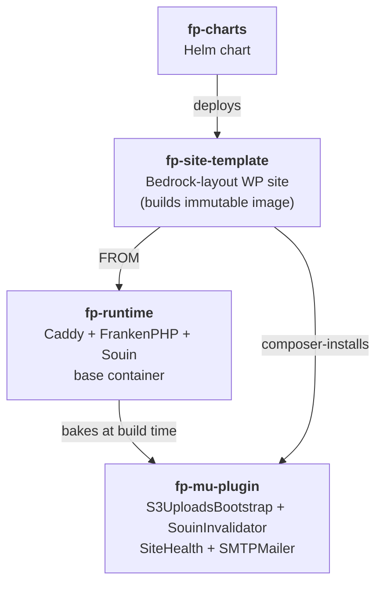
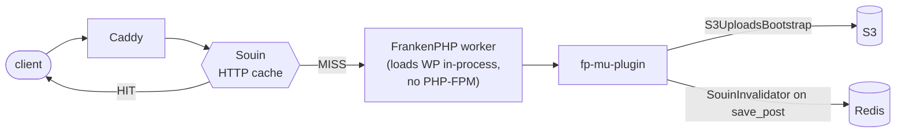
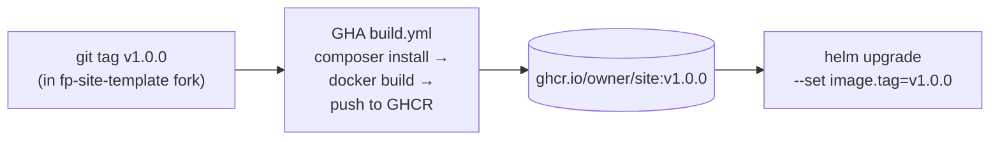

FrankenPress is four repos that compose into one WordPress deployment:

## The four repos

<CardGroup cols={2}>
  <Card title="fp-runtime" icon="cube" href="/components/fp-runtime">
    Container image: Caddy + FrankenPHP + Souin compiled in. Published as
    `ghcr.io/frankenpress/runtime:php8.3`.
  </Card>
  <Card title="fp-mu-plugin" icon="puzzle-piece" href="/components/fp-mu-plugin">
    Slim must-use plugin (4 components): S3 uploads bootstrap, Souin cache
    invalidator, Site Health overrides, opt-in SMTP mailer. Composer-installable;
    baked into `fp-runtime` by default.
  </Card>
  <Card title="fp-site-template" icon="file-code" href="/components/fp-site-template">
    GitHub template repo. Bedrock layout; composer.json with sensible
    minimal deps. Builds your site image on `git push --tags`.
  </Card>
  <Card title="fp-charts" icon="ship" href="/components/fp-charts">
    Helm chart `site`. Bitnami-style; bundles MariaDB + Redis + MinIO
    for instant `kind` deploys.
  </Card>
</CardGroup>

## Request flow

Souin caches GET responses in Redis. On `save_post`,
`SouinInvalidator` connects directly to Redis and `DEL`s the relevant
keys (Souin's documented HTTP-level invalidation APIs are broken in
cache-handler v0.16.0 — see
[`PHASE-0.md`](https://github.com/frankenpress/runtime/blob/main/PHASE-0.md)
for the investigation).

## Image promotion

Each tag produces an **immutable** site image (WP core + plugins + your
custom code baked in). Promoting between environments is a single
`helm upgrade` with a different image tag — no separate code-vs-config
to track.

This composes cleanly with image-promotion tooling like
[Kargo](https://kargo.akuity.io/) or
[Argo Rollouts](https://argoproj.github.io/argo-rollouts/) but doesn't
mandate them. The chart renders a plain `Deployment`; consumers wrap
with whatever orchestration they prefer.

## What stays out

- **No WooCommerce / Yoast / theme picks** in `fp-site-template`. Add what you need via `composer require wpackagist-plugin/<slug>`.
- **No GitOps controller**. The chart renders k8s primitives; you bring your own Argo CD / Flux / Kargo.
- **No multi-cluster federation**. One namespace = one site (use multiple Helm releases for multiple sites in one cluster).
- **No admin-installable plugins/themes/core updates**. The image is the source of truth; the lockdown is hard-coded.

## Production swap matrix

| Default (dev / kind) | Production |
|---|---|
| `bitnami/mariadb` subchart | [MariaDB Operator](https://github.com/mariadb-operator/mariadb-operator) |
| `bitnami/redis` subchart | [DragonflyDB Operator](https://github.com/dragonflydb/dragonfly-operator) (same RESP protocol, dramatically better single-node throughput) |
| `bitnami/minio` subchart | AWS S3 / Cloudflare R2 / GCS XML |
| auto-generated WP keys+salts | [External Secrets Operator](https://external-secrets.io/) → cloud secret manager |

Full production walkthrough: [Operations → Production topology](/operations/production).
