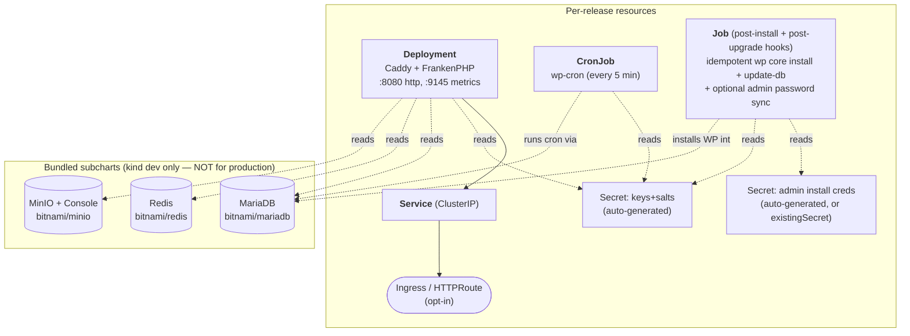

[`fp-charts`](https://github.com/EightOEight/fp-charts) ships **`fp-site`** —
a Helm chart that deploys a single FrankenPress WordPress site to
Kubernetes. Bitnami chart style throughout: every value annotated with
`## @param`, naming + labels via the `bitnami/common` library, optional
subchart deps via the Bitnami OCI registry.

## Install

The chart is published as an OCI artifact on GHCR:

```bash
helm install mysite oci://ghcr.io/eightoeight/charts/fp-site \
  --version 0.1.0 \
  --namespace mysite --create-namespace
```

For the kind-cluster quickstart, see [Quickstart](/quickstart).

For the production topology (DragonflyDB Operator, MariaDB Operator,
AWS S3, External Secrets), see [Operations → Production
topology](/operations/production).

## What gets deployed



The install Job is new in chart **v0.2.0** — fresh deploys produce a
usable site without manual `kubectl exec ... wp core install`. See
[First install](#first-install) below for credentials and the
`syncAdminCredentials` rotation flow.

## Subchart dependencies

| Subchart | Default | Purpose |
|---|---|---|
| `bitnami/common` | always loaded | Library helpers (fullname, labels, image templating) |
| `bitnami/mariadb` | enabled | In-cluster DB for instant deploy. **Not for production.** |
| `bitnami/redis` | enabled | Souin HTTP cache backend. **Production: swap to DragonflyDB Operator.** |
| `bitnami/minio` | enabled | S3-compatible object storage. **Production: swap to AWS S3 / R2 / GCS.** |

<Warning>
  Bitnami withdrew their `bitnami/<name>` images from free public
  Docker Hub in 2025 ("Bitnami Secure Images" commercial pivot). The
  chart's default values point at the `bitnamilegacy/<name>` mirror
  Bitnami publishes for community use. We track this as a Renovate
  concern; see the values.yaml comments.
</Warning>

## Values reference

The full annotated values reference is in
[`charts/fp-site/values.yaml`](https://github.com/EightOEight/fp-charts/blob/main/charts/fp-site/values.yaml);
the most-used keys:

| Key | Default | Purpose |
|---|---|---|
| `image.repository` | `eightoeight/fp-site-template` | Your site image |
| `image.tag` | `""` (chart appVersion) | Pin per release |
| `site.url` | `http://fp-site.localhost` | `WP_HOME` — must match your access URL |
| `site.env` | `production` | Selects `config/environments/<env>.php` |
| `keysSalts.autoGenerate` | `true` | Off → set `keysSalts.existingSecret` |
| `siteInstall.enabled` | `true` | Off → skip auto `wp core install` (use for DB-restore deploys) |
| `siteInstall.adminUser` | `admin` | Auto-generated path |
| `siteInstall.existingSecret` | `""` | BYO Secret (key names configurable) |
| `siteInstall.syncAdminCredentials` | `false` | Reconcile wp_users from Secret on every upgrade |
| `replicaCount` | `1` | Deployment replicas (HPA optional) |
| `ingress.enabled` / `httpRoute.enabled` | `false` / `false` | Pick one for external routing |
| `mariadb.enabled` / `redis.enabled` / `minio.enabled` | `true` / `true` / `true` | Bundled subcharts (kind dev) |
| `externalDatabase.host` | `""` | Used when `mariadb.enabled=false` |
| `externalCache.host` | `""` | Used when `redis.enabled=false` |
| `externalS3.bucket` | `site-media` | Used when `minio.enabled=false` |
| `wpCron.schedule` | `*/5 * * * *` | wp-cron CronJob frequency |
| `tmpfsSize.tmp` / `data` / `config` | `256Mi` / `64Mi` / `16Mi` | tmpfs sizes for the read-only-root pod |

A condensed reference is at [Operations → Configuration](/operations/configuration).

## First install

The chart runs `wp core install` and `wp core update-db` from a
post-install/post-upgrade Helm hook Job — a fresh `helm install`
produces a usable WordPress site without any manual `kubectl exec`.

The install step is idempotent (`wp core is-installed` short-circuits
re-runs), so the Job is safe across `helm upgrade`s.

### Default behavior

By default, the chart creates a `<release>-fp-site-install` Secret with
a random 32-char admin password. Retrieve it after install:

```bash
kubectl --namespace mysite get secret mysite-fp-site-install \
  -o jsonpath='{.data.admin_password}' | base64 -d
```

Override the username, email, or password at install:

```bash
helm install mysite oci://ghcr.io/eightoeight/charts/fp-site \
  --set siteInstall.adminUser=alice \
  --set siteInstall.adminEmail=alice@example.com \
  --set siteInstall.adminPassword=please-change-me
```

### Bring-your-own Secret

Point at a pre-existing Secret with the admin credentials:

```yaml
siteInstall:
  existingSecret: mysite-admin
  existingSecretAdminUserKey: admin_user      # default
  existingSecretAdminEmailKey: admin_email    # default
  existingSecretAdminPasswordKey: admin_password  # default
```

<Note>
  The chart doesn't care how the Secret got there — `kubectl create secret`,
  External Secrets Operator (any provider: AWS Secrets Manager, GCP Secret
  Manager, Vault, 1Password), Sealed Secrets, SOPS-decrypted, anything
  works. The configurable key names let the Secret use whatever schema
  the source system produces.
</Note>

<Tip>
  Already running with auto-generated credentials and now want to move
  them into your secret manager? See
  [Production → Migrating auto-generated Secrets to a secret manager](/operations/production#migrating-auto-generated-secrets-to-a-secret-manager)
  for the `kubectl get secret -o json | jq` extract commands (also
  covers WP keys+salts and the DB / S3 Secrets).
</Tip>

### Password rotation

WordPress stores a *hash* of the admin password in `wp_users`, so simply
updating the Secret value won't change the live login. Set
`siteInstall.syncAdminCredentials: true` and the post-upgrade Job will
run `wp user update` to push the Secret value into the DB on every
release:

```yaml
siteInstall:
  existingSecret: mysite-admin
  syncAdminCredentials: true
```

Then any time the Secret value changes (manual edit, ESO sync, sealed
secret rotation), trigger a `helm upgrade` and the Job reconciles
`wp_users` to match.

The **database password** rotates differently — the Deployment, wpcron
CronJob, and install Job all read `DB_PASSWORD` from `secretKeyRef`, so
when the Secret value changes, restarting pods picks up the new value
automatically. No chart-side reconciliation needed.

### Skipping install

For sites being restored from an existing database dump:

```bash
helm install mysite oci://ghcr.io/eightoeight/charts/fp-site \
  --set siteInstall.enabled=false
```

`wp core update-db` is skipped too, so make sure your dump is
schema-compatible with the WP core version baked into the site image.
If it isn't, re-enable the Job after restore — `wp core is-installed`
will short-circuit and only `update-db` will run.

## Production overrides example

```yaml
# values-prod.yaml
image:
  repository: ghcr.io/your-org/your-site
  tag: v1.0.0

site:
  url: https://mysite.example.com
  env: production

replicaCount: 3
autoscaling:
  enabled: true
  minReplicas: 2
  maxReplicas: 10

ingress:
  enabled: true
  className: nginx
  hostname: mysite.example.com
  tls: true

# Disable in-cluster subcharts.
mariadb:
  enabled: false
redis:
  enabled: false
minio:
  enabled: false

# Point at production services.
externalDatabase:
  host: mysite-mariadb-primary.databases.svc.cluster.local
  database: mysite
  user: mysite
  existingSecret: mysite-db-credentials

externalCache:
  host: mysite-dragonfly.cache.svc.cluster.local
  port: 6379

externalS3:
  bucket: mysite-media-prod
  region: eu-west-1
  bucketUrl: https://cdn.mysite.example.com
  existingSecret: mysite-s3-credentials   # keys: access-key, secret-key

# External Secrets Operator (recommended) for keys+salts.
keysSalts:
  autoGenerate: false
  existingSecret: mysite-wp-keys
```

## CI / publishing

- **`lint.yml`** — `helm lint` + `helm template` + `chart-testing ct lint` on every push and PR.
- **`release.yml`** — on push to main, `helm package` + push to `oci://ghcr.io/eightoeight/charts/fp-site`. Plus `chart-releaser-action` as a github-release fallback.
