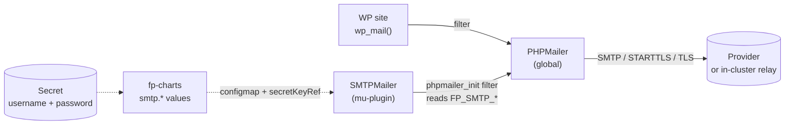

The fp-runtime image deliberately ships no MTA, so PHP's `mail()` fails
silently and `wp_mail()` returns `true` while no email actually
delivers. Every FrankenPress site lands in this silent-fail state by
default. This page is the opt-in fix.

The chart's `smtp.*` values + the
[`SMTPMailer`](/components/fp-mu-plugin#smtpmailer) mu-plugin component
wire `wp_mail()` through any SMTP provider — Postmark, SendGrid,
Mailgun, AWS SES, or an in-cluster relay. Same surface, swap the host.

## How it works



- **Chart**: emits 5 `FP_SMTP_*` env vars from the configmap (host,
  port, encryption, optional from-email/name) plus 2 `secretKeyRef`
  env entries (username, password) into the Deployment, the wpcron
  CronJob, and the install Job.
- **Mu-plugin**: reads those env vars, hooks `phpmailer_init`, sets
  the global PHPMailer's transport.
- **Site Health**: when `FP_SMTP_HOST` is set, the mu-plugin's
  SiteHealth component adds a TCP-reachability test on the
  wp-admin → Site Health screen.

## Quick start

```bash
# 1. Create a Secret with your provider's SMTP credentials.
kubectl -n mysite create secret generic mysite-smtp \
  --from-literal=username=your-smtp-username \
  --from-literal=password=your-smtp-password

# 2. Enable SMTP in your values.
helm upgrade mysite oci://ghcr.io/eightoeight/charts/fp-site \
  --reuse-values \
  --set smtp.enabled=true \
  --set smtp.host=smtp.postmarkapp.com \
  --set smtp.fromEmail=hello@example.com \
  --set smtp.fromName="Your Site Name" \
  --set smtp.auth.existingSecret=mysite-smtp
```

## Provider recipes

Defaults `port: 587` and `encryption: tls` (STARTTLS) work for every
modern SMTP provider — most rows below only need to set `host`. The
`auth.existingSecret` always points at a Secret you create with
`username` and `password` keys.

### Postmark

```yaml
smtp:
  enabled: true
  host: smtp.postmarkapp.com
  fromEmail: hello@yourdomain.com
  fromName: Your Site
  auth:
    existingSecret: postmark-creds
```

The Secret's `username` and `password` are both your **Server API
token** (Postmark uses the same value for both). Set the **Sender
Signature** for `fromEmail` in the Postmark dashboard before sending,
or messages will reject.

### SendGrid

```yaml
smtp:
  enabled: true
  host: smtp.sendgrid.net
  fromEmail: hello@yourdomain.com
  fromName: Your Site
  auth:
    existingSecret: sendgrid-creds
```

The Secret's `username` is the literal string `apikey`; `password` is
your SendGrid API key. Verify the **Sender Authentication** for
`fromEmail` in the SendGrid dashboard.

### Mailgun

```yaml
smtp:
  enabled: true
  host: smtp.mailgun.org   # or smtp.eu.mailgun.org for EU domains
  fromEmail: hello@yourdomain.com
  fromName: Your Site
  auth:
    existingSecret: mailgun-creds
```

The Secret's `username` is the SMTP username from your Mailgun domain
settings (typically `postmaster@yourdomain.com`); `password` is the
SMTP password generated for that user.

### AWS SES

```yaml
smtp:
  enabled: true
  host: email-smtp.eu-west-2.amazonaws.com   # adjust region
  fromEmail: hello@yourdomain.com
  fromName: Your Site
  auth:
    existingSecret: ses-smtp-creds
```

The Secret's `username` and `password` are the **SMTP credentials**
generated from an IAM user with `ses:SendRawEmail` (use IAM → Security
credentials → "Create SMTP credentials" — these are *not* your access
key id / secret access key). Verify the `fromEmail` identity (or its
domain) in SES.

### In-cluster relay (mailpit / mailhog)

For development environments where you want to capture rather than
send mail:

```yaml
smtp:
  enabled: true
  host: mailpit.smtp-test.svc.cluster.local
  port: 1025
  encryption: ""    # mailpit doesn't do TLS by default
  # auth.existingSecret intentionally unset — mailpit accepts unauthenticated SMTP
```

The chart handles unauthenticated SMTP cleanly: when
`auth.existingSecret` is empty, no `FP_SMTP_USERNAME` / `FP_SMTP_PASSWORD`
env is injected, and the mu-plugin sets `SMTPAuth = false`.

## Failure modes

| State | Behaviour |
|---|---|
| `smtp.enabled=false` (default) | No SMTP env injected. `wp_mail()` falls through to `mail()` → silent fail. The install Job suppresses the password-change-notification email on the `syncAdminCredentials` path so you don't see noisy `sendmail: not found` lines in Job logs. |
| `smtp.enabled=true`, server reachable | Email delivers. `wp_mail()` returns `true`. SiteHealth test reports `good`. |
| `smtp.enabled=true`, server unreachable | `wp_mail()` returns `false`. The failure is logged via `error_log` (visible in pod stderr / your log shipper). SiteHealth test reports `critical` with errno + message. **No retry**. |
| `smtp.enabled=true`, auth invalid | Same as unreachable — log + `false` return. Auth failures only surface during the SMTP handshake, not on the SiteHealth TCP-reachability check. |

## What's not in the platform

- **No queueing / retry / async delivery.** Request-time send only. If
  you need transactional reliability for high volumes, install a queue
  plugin (Action Scheduler, etc.) or have the provider handle retries.
- **No transactional email templates.** Site authors handle in WP itself
  or via plugin.
- **No DKIM / SPF / DMARC setup.** Operator-side DNS concern, owned by
  whoever sets up the provider account. Without these your provider
  may quietly send-but-spam-folder.
- **No provider-specific API mode.** SMTP only — universal across all
  providers. Sites that need a provider's API mode can install the
  provider's official WordPress plugin alongside; it'll override
  SMTPMailer's config (last-writer wins on `phpmailer_init`).

## Verify it's working

After deploying with `smtp.enabled=true`:

```bash
# 1. Confirm env reached the pod.
kubectl -n mysite exec deploy/mysite-fp-site -- printenv | grep ^FP_SMTP_

# 2. Confirm the mu-plugin registered the filter.
kubectl -n mysite exec deploy/mysite-fp-site -- \
  wp --allow-root --path=/app/web/wp eval \
  'echo (has_action("phpmailer_init") ? "registered" : "missing") . "\n";'

# 3. Send a test email.
kubectl -n mysite exec deploy/mysite-fp-site -- \
  wp --allow-root --path=/app/web/wp eval \
  'var_export(wp_mail("you@example.com", "test", "hello"));'

# 4. Check Site Health (admin → Tools → Site Health).
#    Look for "FrankenPress SMTP server reachable" — should be green.
```

## Related

- [`fp-mu-plugin` → SMTPMailer](/components/fp-mu-plugin#smtpmailer) — the component reference
- [`fp-charts` values](/components/fp-charts#values-reference) — the `smtp.*` keys
- [Operations → Configuration](/operations/configuration) — full env-var reference
