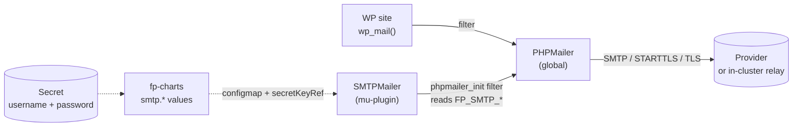

The fp-runtime image deliberately ships no MTA, so PHP's `mail()` fails
silently and `wp_mail()` returns `true` while no email actually
delivers. Every FrankenPress site lands in this silent-fail state by
default. This page is the opt-in fix.

The chart's `smtp.*` values + the
[`SMTPMailer`](/components/fp-mu-plugin#smtpmailer) mu-plugin component
wire `wp_mail()` through any SMTP provider — Postmark, SendGrid,
Mailgun, AWS SES, or an in-cluster relay. Same surface, swap the host.

## How it works



- **Chart**: emits 5 `FP_SMTP_*` env vars from the configmap (host,
  port, encryption, optional from-email/name) plus 2 `secretKeyRef`
  env entries (username, password) into the Deployment, the wpcron
  CronJob, and the install Job.
- **Mu-plugin**: reads those env vars, hooks `phpmailer_init`, sets
  the global PHPMailer's transport.
- **Site Health**: when `FP_SMTP_HOST` is set, the mu-plugin's
  SiteHealth component adds a TCP-reachability test on the
  wp-admin → Site Health screen.

## Before you start: site image must include SMTPMailer

The chart's `smtp.*` values are wiring — the actual SMTP send happens
inside the WP runtime, in the
[`SMTPMailer`](/components/fp-mu-plugin#smtpmailer) mu-plugin component.
Flipping `smtp.enabled=true` against a site image that doesn't include
`fp-mu-plugin >=0.5.0` is a no-op: the env vars get injected, no filter
gets registered, `wp_mail()` keeps falling through to broken `mail()`.

| If your site image is built from… | Action |
|---|---|
| `fp-site-template` (default) | Use **v0.2.4+**. Earlier tags don't include SMTPMailer. |
| A fork of `fp-site-template` | Bump `eightoeight/fp-mu-plugin` in your `composer.json` to `^0.5.0`, run `composer update`, rebuild the site image, then point the chart at the new tag. |
| A custom site image | Same — composer-install `eightoeight/fp-mu-plugin: ^0.5.0` somewhere on the autoloader path. |

You can confirm SMTPMailer is present in a running pod:

```bash
kubectl -n mysite exec deploy/mysite-fp-site -- \
  ls /app/web/app/mu-plugins/fp-mu-plugin/src/ | grep SMTPMailer
```

## Quick start (manual Secret)

For a single-namespace test or a kind-cluster demo:

```bash
# 1. Create a Secret with your provider's SMTP credentials.
kubectl -n mysite create secret generic mysite-smtp \
  --from-literal=username=your-smtp-username \
  --from-literal=password=your-smtp-password

# 2. Enable SMTP in your values.
helm upgrade mysite oci://ghcr.io/eightoeight/charts/fp-site \
  --reuse-values \
  --set smtp.enabled=true \
  --set smtp.host=smtp.postmarkapp.com \
  --set smtp.fromEmail=hello@example.com \
  --set smtp.fromName="Your Site Name" \
  --set smtp.auth.existingSecret=mysite-smtp
```

## Production: ExternalSecret + ESO

Real deployments don't keep credentials in `kubectl --from-literal` — they
pull from a secret manager (AWS Secrets Manager, GCP Secret Manager,
HashiCorp Vault, 1Password Connect, etc.) via [External Secrets
Operator](https://external-secrets.io/). The chart doesn't care how
`smtp.auth.existingSecret` got into the namespace, so any of those work.
The ESO + AWS Secrets Manager recipe (with the API token stored at
`my/asm/path` under field `smtp_token`) looks like:

```yaml
# secrets/postmark.yaml — synced by ArgoCD / Flux into your namespace
apiVersion: external-secrets.io/v1
kind: ExternalSecret
metadata:
  name: mysite-smtp
spec:
  refreshInterval: 1h
  secretStoreRef:
    name: cluster-secret-store
    kind: ClusterSecretStore
  data:
  - secretKey: token
    remoteRef:
      key: my/asm/path
      property: smtp_token
  target:
    name: mysite-smtp
    creationPolicy: Owner
    template:
      data:
        # Postmark uses the same token for both SMTP fields. SES, Mailgun
        # etc. would use distinct username/password — adapt accordingly.
        username: "{{ .token }}"
        password: "{{ .token }}"
```

Then in the chart values:

```yaml
smtp:
  enabled: true
  host: smtp.postmarkapp.com
  fromEmail: hello@yourdomain.com
  auth:
    existingSecret: mysite-smtp
```

<Tip>
  For multi-environment setups (`mysite-staging`, `mysite-production`),
  use a separate provider Server / API token per env so a staging blast
  doesn't burn your production sender reputation. We recommend distinct
  ExternalSecrets pointing at distinct ASM keys
  (`asm/path/staging`, `asm/path/production`) rather than one shared
  Secret with Message Streams.
</Tip>

<Tip>
  Add an env-suffix to `fromName` in your staging values
  (e.g. `fromName: "MySite (staging)"`) so testing emails are
  immediately obvious in inboxes.
</Tip>

## Provider recipes

Defaults `port: 587` and `encryption: tls` (STARTTLS) work for every
modern SMTP provider — most rows below only need to set `host`. The
`auth.existingSecret` always points at a Secret you create with
`username` and `password` keys.

### Postmark

```yaml
smtp:
  enabled: true
  host: smtp.postmarkapp.com
  fromEmail: hello@yourdomain.com
  fromName: Your Site
  auth:
    existingSecret: postmark-creds
```

The Secret's `username` and `password` are both your **Server API
token** (Postmark uses the same value for both). Set the **Sender
Signature** for `fromEmail` in the Postmark dashboard before sending,
or messages will reject.

### SendGrid

```yaml
smtp:
  enabled: true
  host: smtp.sendgrid.net
  fromEmail: hello@yourdomain.com
  fromName: Your Site
  auth:
    existingSecret: sendgrid-creds
```

The Secret's `username` is the literal string `apikey`; `password` is
your SendGrid API key. Verify the **Sender Authentication** for
`fromEmail` in the SendGrid dashboard.

### Mailgun

```yaml
smtp:
  enabled: true
  host: smtp.mailgun.org   # or smtp.eu.mailgun.org for EU domains
  fromEmail: hello@yourdomain.com
  fromName: Your Site
  auth:
    existingSecret: mailgun-creds
```

The Secret's `username` is the SMTP username from your Mailgun domain
settings (typically `postmaster@yourdomain.com`); `password` is the
SMTP password generated for that user.

### AWS SES

```yaml
smtp:
  enabled: true
  host: email-smtp.eu-west-2.amazonaws.com   # adjust region
  fromEmail: hello@yourdomain.com
  fromName: Your Site
  auth:
    existingSecret: ses-smtp-creds
```

The Secret's `username` and `password` are the **SMTP credentials**
generated from an IAM user with `ses:SendRawEmail` (use IAM → Security
credentials → "Create SMTP credentials" — these are *not* your access
key id / secret access key). Verify the `fromEmail` identity (or its
domain) in SES.

### In-cluster relay (mailpit / mailhog)

For development environments where you want to capture rather than
send mail:

```yaml
smtp:
  enabled: true
  host: mailpit.smtp-test.svc.cluster.local
  port: 1025
  encryption: ""    # mailpit doesn't do TLS by default
  # auth.existingSecret intentionally unset — mailpit accepts unauthenticated SMTP
```

The chart handles unauthenticated SMTP cleanly: when
`auth.existingSecret` is empty, no `FP_SMTP_USERNAME` / `FP_SMTP_PASSWORD`
env is injected, and the mu-plugin sets `SMTPAuth = false`.

## Failure modes

| State | Behaviour |
|---|---|
| `smtp.enabled=false` (default) | No SMTP env injected. `wp_mail()` falls through to `mail()` → silent fail. The [`syncAdminCredentials` initContainer](/operations/admin-credential-rotation) suppresses WP's password-change notification on the rotation path so you don't see noisy `sendmail: not found` lines in initContainer logs. |
| `smtp.enabled=true`, admin password rotates via the [`syncAdminCredentials` initContainer](/operations/admin-credential-rotation) | When the initContainer runs `wp user update`, WP fires its built-in **"Password Changed"** notification through the configured SMTP server. **Expected behaviour** — most operators want rotation visible in their inbox. To suppress globally, install a `wp_mail` filter mu-plugin (out of scope for `fp-mu-plugin`; one-line `add_filter('send_password_change_email', '__return_false')`). The initContainer's idempotency check ensures **at most one such email per rotation** regardless of replica count. |
| `smtp.enabled=true`, server reachable, auth + identity valid | Provider accepts the message. `wp_mail()` returns `true`. SiteHealth test reports `good`. **`true` is not the same as "delivered"** — see verification below. |
| `smtp.enabled=true`, server unreachable | `wp_mail()` returns `false`. The failure is logged via `error_log` (visible in pod stderr / your log shipper). SiteHealth test reports `critical` with errno + message. **No retry**. |
| `smtp.enabled=true`, auth invalid | Same as unreachable — log + `false` return. Auth failures only surface during the SMTP handshake, not on the SiteHealth TCP-reachability check. |
| `smtp.enabled=true`, **sender identity unverified** (Postmark Sender Signature, SES verified identity, etc.) | TCP reachability passes, auth passes, the provider rejects with a 5xx during `MAIL FROM`. `wp_mail()` returns `false` and the SMTP response is logged. SiteHealth test stays **green** because TCP-reachability doesn't probe the handshake. **Most common first-time-setup failure** — verify the `fromEmail` identity in the provider dashboard before flipping `smtp.enabled=true`. |
| Site image lacks `fp-mu-plugin >=0.5.0` | SMTP env vars get injected by the chart, but no `phpmailer_init` filter is registered inside WP, so `wp_mail()` keeps falling through to `mail()` and fails silently. SiteHealth's SMTP-reachability test isn't registered either — there's no signal that anything's wrong. See [Before you start](#before-you-start-site-image-must-include-smtpmailer). |

## What's not in the platform

- **No queueing / retry / async delivery.** Request-time send only. If
  you need transactional reliability for high volumes, install a queue
  plugin (Action Scheduler, etc.) or have the provider handle retries.
- **No transactional email templates.** Site authors handle in WP itself
  or via plugin.
- **No DKIM / SPF / DMARC setup.** Operator-side DNS concern, owned by
  whoever sets up the provider account. Without these your provider
  may quietly send-but-spam-folder.
- **No provider-specific API mode.** SMTP only — universal across all
  providers. Sites that need a provider's API mode can install the
  provider's official WordPress plugin alongside; it'll override
  SMTPMailer's config (last-writer wins on `phpmailer_init`).

## Verify it's working

After deploying with `smtp.enabled=true`:

```bash
# 1. Confirm env reached the pod.
kubectl -n mysite exec deploy/mysite-fp-site -- printenv | grep ^FP_SMTP_

# 2. Confirm the mu-plugin registered the filter.
kubectl -n mysite exec deploy/mysite-fp-site -- \
  wp --allow-root --path=/app/web/wp eval \
  'echo (has_action("phpmailer_init") ? "registered" : "missing") . "\n";'

# 3. Send a test email — to an address you actually control.
kubectl -n mysite exec deploy/mysite-fp-site -- \
  wp --allow-root --path=/app/web/wp eval \
  'var_export(wp_mail("you@example.com", "test", "hello"));'

# 4. Check Site Health (admin → Tools → Site Health).
#    Look for "FrankenPress SMTP server reachable" — should be green.
```

<Warning>
  **`wp_mail()` returning `true` does not mean the email was delivered.**
  It means PHPMailer's SMTP handshake completed and your provider
  accepted the message — the message can still bounce, get filtered
  to spam, fail content-policy checks, or never reach the recipient
  at all. **Always cross-check by:**

  1. Looking at the recipient inbox (and the spam folder).
  2. Looking at the provider's Activity / Messages dashboard
     (Postmark → Activity, SES → SMTP logs, Mailgun → Logs,
     SendGrid → Activity Feed). The provider's own dashboard is the
     authoritative "did the message actually leave" check.

  If `wp_mail()` returns `false`, look at pod stderr — `SMTPMailer`
  logs `[FrankenPress\\SMTPMailer]` errors with the SMTP response.
  Most common first-time culprit is sender-identity rejection
  (Postmark Sender Signature, SES verified identity, etc.).
</Warning>

## Operations

### Token rotation

When you rotate the API token in your provider's dashboard:

1. Update the value at the source (your secret manager).
2. ESO refreshes the K8s Secret on its `refreshInterval` (1 hour by
   default). The Secret in the namespace will pick up the new value
   transparently.
3. **Running pods don't notice** — env vars were injected at pod start.
   Roll the Deployment so new pods read the rotated value:

   ```bash
   kubectl -n mysite rollout restart deploy/mysite-fp-site
   ```

The wpcron CronJob and the post-install/post-upgrade Job each pull
fresh env on every invocation, so they always use the latest token.
Only the long-running Deployment needs the manual roll.

### Auto-rolling on Secret change (Reloader)

If you rotate often (or just don't want a manual `kubectl rollout
restart` in your runbook), install
[**Stakater Reloader**](https://github.com/stakater/Reloader) cluster-wide.
It watches `Secret` and `ConfigMap` objects and triggers a rolling
update on associated workloads when their content changes — closing
the gap between "ESO refreshed the Secret" and "running pods see the
new value".

Install via the Helm chart on Artifact Hub:

```bash
helm repo add stakater https://stakater.github.io/stakater-charts
helm install reloader stakater/reloader -n reloader --create-namespace
```

Then opt the fp-site workload into auto-reloads in your values. Use
`commonAnnotations`, **not** `podAnnotations` — Reloader watches the
Deployment object's `metadata.annotations`, not the pod-template's
`spec.template.metadata.annotations`:

```yaml
commonAnnotations:
  # Watch every Secret + ConfigMap referenced by this Deployment.
  # When any of them change, Reloader does a rolling restart.
  reloader.stakater.com/auto: "true"
```

Or — more conservative — pin specific Secrets:

```yaml
commonAnnotations:
  # Only restart on changes to these named Secrets.
  secret.reloader.stakater.com/reload: "mysite-smtp,fp-site-keys,mysite-db-credentials"
```

<Note>
  `commonAnnotations` is applied to every resource the chart renders
  (Service, ConfigMap, Secret, Job, CronJob, ServiceMonitor, etc.), not
  only the Deployment. The Reloader annotations on non-workload resources
  are harmless — Reloader only acts on Deployments, StatefulSets, and
  DaemonSets — but they will be visible if you `kubectl describe` other
  objects.
</Note>

<Note>
  Reloader is platform-wide infrastructure, not SMTP-specific. Once
  installed it solves the same "manual rollout-restart" problem for
  every Secret the chart references — the database password, the
  WP keys+salts, S3 credentials, and the SMTP token. Worth installing
  once for the whole platform if any of those rotate on a schedule.
</Note>

The wpcron CronJob and install Job don't need Reloader — they're
short-lived and pull fresh env on every invocation.

### Sender-identity verification

Most providers require you to prove ownership of the `fromEmail`
address (or its domain) before they'll accept sends. Skipping this is
the single most common first-deploy gotcha — the SMTP handshake
succeeds, auth succeeds, but the provider rejects `MAIL FROM` with a
5xx and `wp_mail()` returns `false`.

| Provider | Where to verify |
|---|---|
| Postmark | Dashboard → Servers → (your Server) → Sender Signatures (per-address) or Domains (whole domain — recommended) |
| SendGrid | Settings → Sender Authentication → Verify a Single Sender / Authenticate Your Domain |
| Mailgun | Sending → Domains → (your domain) → DNS records |
| AWS SES | Identities → Create identity (Domain or Email address) |

Domain-level verification is preferred over per-address — one DNS
config, all addresses on that domain become valid `fromEmail` values
forever. Plus DKIM signing only works at the domain level.

## Related

- [`fp-mu-plugin` → SMTPMailer](/components/fp-mu-plugin#smtpmailer) — the component reference
- [`fp-charts` values](/components/fp-charts#values-reference) — the `smtp.*` keys
- [Operations → Configuration](/operations/configuration) — full env-var reference
